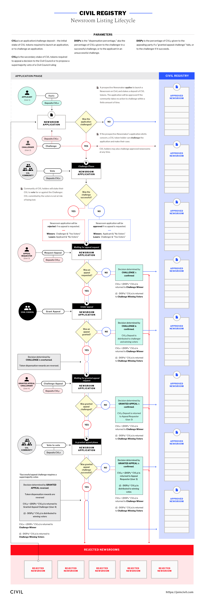

# Civil Token Curated Registry

The CivilTCR is a Token Curated Registry based on [Mike Goldin's / AdChain's original implementation](https://github.com/skmgoldin/tcr) with a few modifications:

* Listings are keyed by the address of an owned contract, rather than arbitrary hashes
* Only the owner of the contract can apply on its behalf
* After the challenge voting has ended, users can appeal (by depositing tokens) to have the appellate entity consider overturning the result of a challenge
* If the appellate overturns the challenge result, that decision can be challenged by users as well (by matching the deposit in the previous step), which begins another vote that requires a supermajority in favor in order to veto the granted appeal.

A flow-chart detailing the application/listing lifecycle is included at the bottom of this page.

Documentation for contracts are generated using `doxity` and can be found at [http://dapp.staging.cvl.pub/contracts](http://dapp.staging.cvl.pub/contracts)

## Voting

Our voting system is a Partial-Lock Commit-Reveal Voting contract based on [Mike Goldin's / ConsenSys' original implementation](https://github.com/ConsenSys/PLCRVoting) with a few modifications required to properly distribute tokens to voters when a challenge vote is overturned by the appellate:

* Added `getNumLosingTokens(address _voter, uint _pollID, uint _salt)` and `getTotalNumberOfTokensForLosingOption(uint _pollID)` since an overturned challenge treats the losers as the winners, and thus these values are needed to properly calculate payouts.

When voting within the Civil ecosystem, it's important to know what the vote options mean.

A "passed" vote is one in which the percentage of YES (1) votes is greater than the `voteQuorum` for the poll.

* A vote of YES (1) on a `CHALLENGE` poll means that you "agree with the challenger" that the application/listing should be removed.
* A vote of NO (0) on a `CHALLENGE` poll means that you "do not agree with the challenger" and believe the application/listing should be whitelisted.
* A vote of YES (1) on an `APPEAL CHALLENGE` poll means that you "agree with the appeal challenger" that the granted appeal should be overturned.
* A vote of NO (0) on an `APPEAL CHALLENGE` poll means that you "agree with the appellate" and that their decision should stand.

## Parameters

The parameters used by various aspects of the CivilTCR (e.g. the length of an application) are controlled by the `Parameterizer` contract, based on [Mike Goldin's / AdChain's original implementation](https://github.com/skmgoldin/tcr) with 2 very minor modifications:

* Initializing a few additional parameters in the constructor to support the appeal challenge process.
* Using an array of values to initialize parameters in constructor, rather than individual constructor parameters, because the additional parameters we added were putting us over the limit for a transaction (when added as individual constructor parameters) and the contract couldn't be initialized.
* The `PROCESS_BY` constant has been turned into parameter `pProcessBy`

## Government

The `Government` contracts (which implements `IGovernment`) controls various parameters related to the appeals process (`requestAppealLen, judgeAppealLen, appealFeemappealVotePercentage`), and parameters internal to the government vote logic (`govtPCommitStageLen, govtPRevealStageLen`), as well as the `appellate` entity address and `governmentController` entity address. `CivilTCR` maintains an instance of `IGovernment` originally set in the constructor, which can be updated by the `governmentController`.

The intention is that once a more fully developed Government contract is ready, the government controller will transfer the government to the new version, which will have no government controller, meaning that it could not be transfered again.

This contract also maintains a reference to the hash of the current "Constitution", the document that is intended to guide participants in the system.

The `appellate` entity (and only them) is able to propose new values for the parameters it controls (via the `proposeReparameterization` function), as well as new values for the constitution URI and hash (via the `proposeNewConstitution` function). When new values are proposed, a PLCRVoting poll is immediately started in which all token holders vote to confirm or deny the proposed value. In order for values to be updated, they must be supported by an `appealVotePercentage` of token-votes. Once the poll has ended, the proposals (whether a `GovtParamProposal` or a `NewConstProposal`) can be updated by calling (`processProposal` or `processConstChangeProp` respectively). If a proposal is not updated within 7 days (`PROCESSBY`) of the poll ending, the proposal is removed without changing any values.

Similar to in the Parameterizer, there cannot be 2 identical parameter proposals active at a given time. Furthermore, only 1 constitution change proposal is allowed to be active at a time.

The `governmentController` entity is able to unilaterally set the `appellate` entity.

